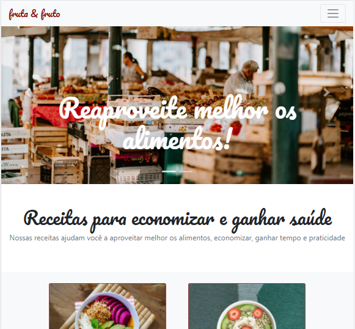
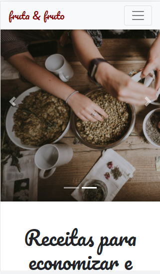

# Fruta & Fruto

Projeto simulando uma página com dicas de receitas naturais.

## Motivação

Projeto com fins de estudo, aprendizagem e prática na criação de uma páginas estatica responsivel, utilizando Bootstrap 4.

## Tecnologias Utilizadas

- Bootstrap 4
- HTML
- CSS
- Visual Studio Code

## Autor

- Douglas Andrade dos Santos
